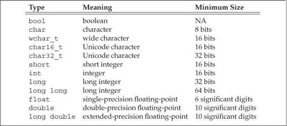

# 2. Chapter 02 - Variables and Basic Types

**Types** tell the programmer what data means and the operations that can be performed on that data. For example in the following statement:

```cpp
a = a + b;
```

The result of these statement depends on the types of `a` and `b`. This chapter covers the primitive types such as characters, integers, floats and other built-in types and how these can be used to support more complicated types.

## 2.1 Primitive Built-in Types

The **primitive built-in types** include the following:

- **Arithmetic types**: Used to represent characters, integers, booleans, floating point values. They are divided into two categories: **Integral types** and ** Floating-point types**.
- **void type**: A type that has not associated values.

### 2.1.1 Arithmetic types

The size, the number of bits, of **arithmetic types** varies accross machines, and the standard only guarantees minimum sizes as listed in the following table:



The **integral types** include the following:

- **bool**: Represents `true` or `false` values.
- **char**: The `char` type is the same size as a single machine byte.
- **wchar_t**: Used for extended character sets. Guaranteed to be big enough to hold any character in the machine's largest extended character set.
- **char16_t** and **char32_t**: Used for extended character sets. Intended for Unicode characters.
- **short**, **int**, **long** and **long long**: Used to represent integer values of different sizes.

The **floating-point types** include the following:

- **float**: Single precision values, they usually take 32 bits.
- **double**: Double precision values, they usually take 64 bits.
- **long double**: Extended precision values, they usually take from 96 to 128 bits.

### 2.1.2 Unsigned and signed types

The **integral types char, short, int, long** and **long long** can be:

- **Signed**: Represents negative or positive numbers, including zero. For signed types, the standard says that the range of values for positive and negative values should be evenly divided.
- **Unsigned**: Represents positive values and zero. For unsigned types, all the bits represents the value.

By default, the types **short**, **int** and **long** are all signed, but one can add the unsigned keyword to obtain the corresponding unsigned type, for example:

```cpp
unsigned int a;
unsigned short b;
```

By default, the type **char** signedness depends on the compiler, one can explicitely declare the signedness of a **char** type using one of the keywords mentioned in this section.

### 2.1.3 Type conversions

Types support the ability to **convert** objects of a given type to another.

Type conversions happen implicitly when an object of one type is used where an object of a different type is expected. In particular, for arithmetic values, what happens in a type conversion depends mostly on the range of values that the types permit:

1. When we assign a non bool arithmetic type to a `bool` object, the result is false if the value is zero and tru otherwise.
2. When we assign a `bool` to one of the other arithmetic types, the resulting value is one if the bool is `true` and zero if the bool is `false`.
3. When we assign an integral value to an object of floating-point type, the fractional part is zero.
4. When we assign a floating-point type to an integral value, the value is truncated.
5. When we assign an out-of-range value to an object of unsigned type, the result is the remainder of the value modulo the number of values that the target type can hold. This can be better understood with an example: An `unsigned char` can hold values from 0 to 255, that is 256 values, if we assign the value 256 to an `unsigned char` the compiler will assign the value 0.
6. If we assign an out-of-range value to an object of signed type, the result is undefined. The program might appear to work, it might crash or it will produce garbage values.

This behaviour doesn't limit to assignments, it also applies when testing conditions and the like.

### 2.1.4 Literals

Every **literal** has a type, determined by its form and value.

#### 2.1.4.1 Integer and floating-point literals

We can write **integer literals** in decimal format, in hexadecimal format and in octal format as follows:

```cpp
20;	// Decimal
020; // Octal, begins with a zero.
0x20; // Hexadecimal, begins with a 0x or a 0X.
``` 

The type of integer literals depends on its value and notation, by default, decimal literals are signed and have the smallest type `int`, `long` or `long long` in which the literal's value fits. Octal and hexadecimal can be either signed or unsigned and have the smallest type of `int`, `unsigned int`, `long`, `unsigned long`, `long long` or `unsigned long long` in which the value of the literal can fit. There are no literals of type `short`. You can override these defaults by using any of the suffixes in this table:


**Floating-point** literals include either a decimal point, ., or an exponent, e or E, specified using scientific notation. Some examples could be the following:

```cpp
3.14159;
0.;
0e0;
.001;
3.14159E0;
```
By default, floating-point literals have type `double`, but you can override it using any suffixes in the table above.

You can combine suffixes to define the type and signedness of the literal, for example:

```cpp
L'a';		// Wide character literal, type is wchar_t
u8"hi";		// utf-8 string literal (utf-8 encodes a Unicode character in 8 bits)
42ULL;		// unsigned integer literal, type is unsigned long long
1E-3F;		// single-precision floating-point literal, type is float
3.14159L;	// extended-precision floating-point literal, type is long double
```

#### 2.1.4.2 Character and character strings literals

A character enclosed within single quotes, `''`, is a literal of type `char`. Zero or more characters enclosed in double quotation marks, `""` is a string literal.

```cpp
'a';
"String"; 
```

A string is an **array** of constant characters, the compiler appends appends a `'\0'` to every string literal, to indicate where it ends, so the actual size of a string is the amount of characters enclosed in the double quotes plus one. Two string literals that are only separated by spaces, tabs or newlines are concatenated together into a single string literal, for example:

```cpp
"hello" "hello";
"hello"
"hello";
```

In order to use non-printable characters one would use what is called as **escape sequences**, which are summarized in the following table:


These are used as any normal character.

#### 2.1.4.3 Boolean and pointer literals

The words `true` and `false` are literals of type `bool`.

The word `nullptr` is a pointer literal. Pointers will be expanded in the following chapters.

## 2.2 Variables

A **variable** provides the programmer with named storage that the programs can manipulate. Each variable has an associated type which determines:

- The size.
- The layout of the memory of the variable.
- The range of values that can be stored within the variable.
- The set of operations that can be applied to the variable.

C++ programmers tend to refer to **variables** as **variables** or **objects**.

### 2.2.1 Variable definitions

A simple **variable definition** consists of a type specified (the name of the type), followed by a list of one or more variable names separated by commas, optional initialization for each of those variables and ends with a semicolon. Variable definition examples are shown in the following example:

```cpp
int sum, value = 0,
	units_sold = 10;
```

### 2.2.2 Variable initialization

An object which is initialized gets the specified initialization value at the moment the object is created, this makes it possible to initialize a variable to the value of one defined earlier in the same definition. Examples are shown below:

```cpp
int a = 10, b = 10 * a;
```

It is important to remember that an initialization is not an assignment, an initialization happens when a variable is given a value at the moment it is created, assignment obliterates the current value of an object and replaces its value with a new one. 

Another way to initialize variables is by using parentheses:

```cpp
int a(10), b(10*a);
```

#### 2.2.2.1 List initialization

C++ defines several forms of initialization, one form of initialization which includes a generalized use of curly braces is usually referred to as **list initialization**:

```cpp 
int units_sold = {0};
int units_sold{0};
```

Both statements above define an `int` variable named `units_sold` and initialize it to `0`. This form of initialization has one important property: The compiler willl not let us unitialize variables of built-in type if the initialization might lead to loss of information:

```cpp
long double ld = 3.14159;
int a{ld}, b = {ld}; // The compiler will give an error.
int a(ld), b = ld; // This is OK, the value will be truncated and both variables will have a value of three.
```

#### 2.2.2.2 Default initialization

When a value is defined and there is no initialization, we say the variable is **default initialized**, these variables are given a default value which depends on the type of the variable and where the variable is defined.

The value of an object of built-in type that is default initialized depends on where the variable is defined, if the variable is defined inside a function the value of the variable is undefined and this might cause problems, if the variable is defined outside any function the variable is initialized to zero (except for some exceptions which shall be covered in the next chapters).

For objects that belong to a class, it is up to the class how default initialized objects of that class are handled, it is the class that defines the default initialization value. For example, the `string` class says that if we do not supply an initializer, the resulting `string` is the empty string `""`.

### 2.2.3 Variable declarations and definitions

C++ supports programs to be written in logical parts by using what is commonly known as separate **compilation**, separate compilation allows programs to be split into several files that can be compiled independently. This creates a new issue, we need a way to share code accross those files, code defined in one place might need to be used in another file.

For this reason, C++ distinguishes between declarations and definitions:

- A **declaration** makes a name known to the program, a file that wants to use a name defined elsewhere includes a declaration of that name. In the case of variables, a variable declaration includes the type and name of the variable. A variable can be declared as many times as the user wants.
- A **definition** creates an entity, it is a declaration, in addition to specifying the name and type, it also allocates storage and may provide the variable with an initial value. A variable can be defined only once.

To obtain a declaration one can use the `extern` keyword, without providing an initialization value, as follows:

```cpp
extern int j;	// Declares but does not define j
int j;	// Declares and defines j.
```

Its usually a good practice to define objects near the point where the object is first used, doing this improves readability and makes it easier to find the definition of variables. Some standards do not support these though.

### 2.2.4 Identifiers

**Identifiers** are sequence of characters that make up a name, they are case sensitive and can be composed of letters, digits and the underscore character. They have no limits in name length and they must begin with either a letter or an underscore. The C++ language reserves a group of names for its own use that can't be used as identifiers. These names can be found in the tables below.

These are the C++ keywords:


There are the C++ alternative operator names:


The standard library also reserves a group of names. Some other rules related to identifiers are that they can't contain two consecutive underscores, they can't begin with an underscored followed immediately by an uppercase letter and identifiers defined outside a function can't begin with an underscore.

### 2.2.5 Scope of a name

A given name can be reused to refer to different entities at different points in a program. A **scope** is a part of the program in which a name has a particular meaning. Most scopes in C++ are delimited by curly braces. Names are visible from the point where they are declared until the end of the scope in which the declaration appears.

In the following example:

```cpp
int main ()
{
	int sum = 0;
	for (int val = 0; val <= 5; val++)
		sum += val;
	return 0
}
```

The name `main` has a global scope, it can be accesible from anywhere in the program. The name `sum` can only be used within the body of main, and the name `val` can only be used within the body of the for loop in the function `main`.

Scopes can be nested, the contained scope is referred to as **inner scope** and the containing scope is **outer scope**. In the following example:

```cpp
int global;			// Global has global scope.
int main () {
	int unique = 0; // Scope is limited to the function body of main.
	int global;		// Hides global variable, creates local variable named global. Scope is limited to the function body of main.
	::global;		// Using the scope operator to refer to the variable named global with global scope.
}
```

While it is usually a very bad practice to define local variables with the same name as global variables, this program serves to explain inner and outer scopes.

## 2.3 Compound types

A **compund type** is a type defined in terms of another type, **references** and **pointers** are examples of compound types.

### 2.3.1 References

In this section we explain **lvalue reference**, not to be mistaken with **rvalue reference** which will be explained in later chapters. When we speak about references we usually refer to **lvalue references**.

A **reference** is an alternative name for an existing object, it's not an object, it's like an alias. A reference can be defined with the ampersand, `&` character like this:

```cpp
int value;
int &ref_value_0 = value;	// Now ref_value is an alternative name for the variable value.
int &ref_value_1 = value, &ref_value_2 = value; // Defining multiple references.
int value_3 = 1, &ref_value_3 = value; // Defining a variable and then a reference.
```

When a reference is initialized, the reference is bounded to it's initializer, there is no way to rebind a reference so references must be initialized. Also, a reference can't be an initializer of another reference.

The following code will cause the compiler to raise an error.

```cpp
int val = 0;
int &ref_value_0 = val;
int &ref_value_1; // ERROR: A reference must be initialized.
int &ref_value_2 = ref_value_0; // ERROR: A reference can't be the initializer to another reference.
```

When assigning a value to a reference, we are assigning the value to the object bound to the reference, the same behaviour applies when fetching the value of a reference or when initializing a variable using a reference. For example:

```cpp
int val = 0;
int &ref_val = val;
ref_val++;	// Same as val++
```

A reference has to be bound to an object, the initializer of a reference can't be, for example, a literal expression, and, with a few exceptions, the type of the reference and the type of the variable the reference is bound to must match exactly.

```cpp
int &ref_value_0 = 10;  // ERROR: A reference can't be bound to a literal expression.
float f_val = 10.325;
int &ref_value_1 = f_val; // ERROR: The type of the reference and the type of the object do not match.
```

### 2.3.2 Pointers

A **pointer** is another compound type that basically points to another type. Pointers are objects that are used for indirect access to another objects.

Pointers are defined using the star, `*`, character like this:

```cpp
int *a;           // Defining a pointer int.
int *b, *c;	// Defining two pointers to int.
int d, *e;	      // Defining an int variable and a pointer to int.
```

A pointer holds the address of an object, to retrieve the value of an object we use the ampersand character, `&` like this:

```cpp
int ival = 42;
int *pt_val = &ival;  // Now pt_val contains the address to the ival variable.
int &ref_val = ival;
int *pt_ref_val = &ref_val;  // ERROR: A reference is not an object.
```

When used in this way, the `&` character is called the **address-of operator**.

With a few exceptions, the type of the pointer and the object it points to must match, the reason for this is because the type of pointer is used to infer the type of the object it points to, if a pointer points to an object of another type, the operations on the object pointed will fail.

```cpp
int val = 0;
float *pt_val = &val; // ERROR: Will not compile because initializer is not a pointer to float.
```

It is not possible to assign a pointer the value of a object, for example the following example will fail:

```cpp
int val = 12345;
int *pt_val = val; // ERROR: Can assign a pointer the value of an int.
```

#### 2.3.2.1 Null pointers

**Null pointers** are pointers that do not point to any object, it is a good practice that a pointer is not `null` before attempting to use it. The recommended approach to obtain a null pointer is using the literal `nullptr`, for example:

```cpp
int *ptr = nullptr;
double *ptr = nullptr;
```

As the examples above show, the literal `nullptr` can be converted to pointers of any type.

There are other ways to obtain the a NULL pointer, however these are deprecated in C++, it is common to see them in C programs though.

```cpp
int *p2 = 0;
int *p2 = NULL; // For this you will need to include stdarg.h header from C or cstdlib.
```

#### 2.3.2.2 Values of a pointer

The address stored in a pointer can be any of the following:

1. An address to an object.
2. An address to the location just inmmediately past the end of an object.
3. A **null pointer**, indicating that the pointer doesn't point to any object.
4. An invalid address, values other than the three above are invalid values.

It's important to ensure that pointers are valid, when using invalid pointers the behaviour is undefined and it is unlikely that the compiler will detect any errors. Although 2. and 3. are valid pointers, we can't use them to access the object they are supposedly pointing to, as they are not pointing to any object and therefore the behaviour is undefined too.

#### 2.3.2.3 Using pointers to access an object

When a pointer is valid and it points to an object, we can use the star character, `*`, in this way to access the object which the pointer points to:

```cpp
int val = 42;
int *pt_val = &val;
cout << *p;            // Will print the val.
```

When used in this fashion, the star character is known as the **dereference operator**.

Dereferencing a pointer returns the object it points to, we can, for example, assign a new value to an object through a pointer like this:

```cpp
int val = 42;
int *p = &val;
*p = 30; // The value of the variable val has changed.
```

#### 2.3.2.4 The importance of initializing pointers

Using uninitialised pointers will lead to undefined behaviour when accessing the supposed object that the pointer points to, and there is no way to distinguish between valid addresses and invalid addresses from pointers that have not been initialized.

For this reason it's important to initialize pointers, if the object that pointer will point to has not been defined it is advisable to initialize the pointer to `nullptr`, this way the program will know whether the program points to an object or not.

```cpp
int *p1;
*p1 = 0;  // Will lead to undefined behaviour.
```

#### 2.3.2.5 Using a pointer as a condition

A pointer with a value equal to `nullptr` will evaluate as `false`, a pointer with a different value will evaluate to `true`, even if the pointer doesn't point to an object.

```cpp
int val = 0;
int *pt = &val;

if (pt); // Will evaluate to true.

pt = nullptr;

if (pt); // WIll evaluate to false.
```

When testing for equality or inequality between pointers, two pointers are equal when they point to the same location and they are unequal otherwise.

```cpp
int val_0 = 0;
int *pt_val_0 = &val_0, *pt_val_1 = &val_0;

if (pt_val_0 == pt_val_1); // Will evaluate to true.

pt_val_1 = nullptr;

if (pt_val_0 == pt_val_1); // Will evaluate to false.
```

The behaviour when evaluating invalid pointers is undefined.

#### 2.3.2.6 Pointers to void

A **pointer to void**, `void*`, can point to an object of any type, it will contain an address but the type of the object it points to is unknown.

```cpp
float fval = 3.14;
int ival = 3;
void *pt = &fval; // Valid.
pt = &ival; // Also valid.
```

A pointer of this type can't be used to access the object, as the type of the object is unknown and it's the type that determines what kind of operations can be performed with an object.

One of the usages of pointers to void is to deal with memory as memory, rather than as a object.

#### 2.3.2.7 Pointers to pointers

There are no limits in the number of type modifiers that can be applied to a declarator. We can apply this to pointer as they are objects after all, so this means that they have an address in memory, an address that can be stored in another pointer, thus creating a pointer to pointer, we could continue the chain endlessly.

In the following code:

```cpp
int ival = 1024;
int *pi = &ival;
int **ppi = &pi;
```

Dereferencing `ppi`, a pointer to a pointer, returns a pointer, `pi`, and dereferencing this pointer will return the object of type `int`, `ival`. This graphic details the process:


#### 2.3.2.8 References to pointers

Because pointers are objects, references can be bound to pointers, defining a reference of this kind can be a bit tricky, here is an example:

```cpp
int val = 40;
int *p_val = &val;
int *&p_val_ref = p_val;
```

References to pointers can be dereferenced and can be used in the same fashion as other types of references.

## 2.4 The `const` type qualifier

To make a variable unchangeable we use the type qualifier `const`, this way assignments or any other operation that would make the value of the variable change will cause an error, for example:

```cpp
const int a = 10;
a = 5;	// ERROR: Attempting to modify a constant object.
```

An object with a `const` type qualifier can use some of the operations of its non-constant version, only those that won't change the object, for example:

```cpp
const int a = 10;

if (a); // Will work and will evaluate to true.

a++; // ERROR: Will not work because the operation changes the object.
```

An object declared with the type qualifier `const` must be initialized, as once it has been declared, it can't be changed. During the initialization, it doesn't matter if the object is `const` or not, operation that change the object can be used during the initialization:

```cpp
int a = 10;
const int b = a; // Will work because we are assigning a value during the initialization.
```

### 2.4.1 Scope of `const` objects, using the `extern` keyword

By default, objects with the `const`type qualifier initialized with a compile-time constant, like for example the following code:

```cpp
const int a = 0;
```
have a **scope local to the file**. When defining a variable with the same name and the `const` type qualifier is like if we had defined different variables in each file.

What the compiler usually does with these type of objects is replace the name of the variable with its value. In order to do this in multiple files, the files where the object has not been defined need to have access to the initializer of the object.

To solve the issue above, we can use the `extern` keyword to define a single instance of a `const` object, in both the definition and in the declaration:

```cpp
// In the first file, source file, define and initialize the const object with the extern keyword.
extern const int shared_const = 1024;
// In the first file, header file, write the declaration using the extern keyword.
extern const int shared_const;
// In the rest of files that include this header file, the value used will be the value defined in the source file.
```

In a way, this behaviour is similar to defining a constant macro using the preprocessor in C:

```c
const int value = 0;
#define VALUE 0
```

### 2.4.1 References to `const` objects

References can be used with objects defined with the `const` type qualifier, to do so we create **references to `const`**. This type of reference can't be used to change the object bound to the reference.

```cpp
const int a = 0;
const int &ref_a = a; // Here we initialize a reference to const.
ref_a = 1; // ERROR: Will fail because a reference to const can't be used to change the object it's bound to.
```

Contrary to other references, a **reference to `const`** can be bound to any of the following:

1. An object not defined with the `const` type qualifier.

	A reference to `const` can be bounded to an object that hasn't been defined with the `const` type qualifier, but the operations we can do on that object through this reference are restricted to operations that won't change the object.
	
	```cpp
	int a = 0;
	const &r_a = a; // This is a reference to const that is bounded to a non-const object.
	r_a++; // ERROR: This is not a valid operation, can't change the value of the bounded object through a reference to const.
	a++; // This is a valid operation.
	```

2. A literal expression or a more general expression.

	The following are examples of this type of initialization:
	
	```cpp
	const int &r1 = 2;
	const int &r2 = 2 * 2;
	```

3. Any expression that can be converted to the type of the reference.

	This is an example of this type of initialization:
	
	```cpp
	float fval = 3.14;
	const int &ival = fval; // This is a valid reference to const.
	```

	What the compiler really does with the code above is create a temporary object like this, and then bound the reference to `const` to that temporary object:
	
	```cpp
	const int fval_temp = fval;
	const int &ival = fval_temp;
	```

### 2.4.2 Pointers and the `const` type qualifier

In this section we will explain the `const` type qualifier applied to pointers.

#### 2.4.2.1 Pointers to `const` objects

A **pointer to `const`** is one that can't be used to change the object it points to. Like **references to `const`**, this type of pointers only restrict the operations we can do on the object through the pointer.

A **pointer to `const`** can be initialized in any of the following ways:

1. With an address of a `const` object, only pointers to `const` can store such kind of address.

	The following code is an example of this initialization:

	```cpp
	const int a = 0;
	const int *ptr_0 = &a; // Pointer to const pointing to a object.
	int *ptr_1 = &a; // ERROR: Plain pointer to a const object.
	```

2. With an address to an object without the `const` type qualifier:

	In this case, we won't be able to modify the object that the pointer is pointing to through the use of the pointer.
	
	```cpp
	int val = 0;
	const int *val = &val;
	```

#### 2.4.2.2 Constant pointers

Because pointer are objects, the `const` type qualifier can be applied to them, thus creating what we will define as **constant pointers**. The same rules as other constant objects apply to constants pointers, e.g. a constant pointer must be initialized and once it has been initialized the address it contains can't be changed.

We define a **constant pointer** by putting the `const` type qualifier after the star character, `*`, like this:

```cpp
int val = 0;
int *const a = &val; // This is a constant pointer to int.
const int *const b = &val; // This is a constant pointer to const int.
```

A **constant pointer** doesn't tell whether the object it points to can be modified through the use of this pointer, this depends on the type qualifier applied to the object it's supposed to, specified in the definition of the variable.

### 2.4.3 Top-level and low-level `const`

The term **top-level `const`** indicates that an object itself is constant, it can appear in objects of any type.

The term **low-level `const`** appears only in compound type definitions, such as pointers and references.

#### 2.4.3.1 Top-level and low-level `const` applied to pointers

The term **top-level `const`** is used to indicate that a pointer is `const`, this is, a **constant pointer**.

The term **low-level `const`** is used to indicate that a pointer points to a `const` object, this is, a **pointer to `const`**.

Notice that a pointer can have **both top-level and low-level `const`**, this is, a **constant pointer to `const`**.

### 2.4.4 The `constexpr` keyword

By using the `constexpr` type qualifier instead of the `const` type qualifier we ask the compiler to verify that a variable is a constant expression and we also make it have **top-level `const`**.

```cpp
constexpr int a = 20; // Compiler will check that 20 is a constant expression that can be evaluated at compile time.
constexpr int b = a * 58// // Compiler will check that a * 58 is a constant expression that can be evaluated at compile time.
constexpr int c = size(); // Compiler will check that the size function is a constexpr function, and that it can be evaluated at compile time.
constexpr int *d = nullptr; // Compiler will check that nullptr is a constant expression that can be evaluated at compile time. This is a constant pointer, and not a pointer to const, this is because constexpr gives the object top-level const.
```

Only types that can have literal values can be used with the `constexpr` type qualifier, for example the arithmetic types, the reference types and the pointer types can be used with the `constexpr` type qualifier, but for example the `string` type can't.

## 2.5 Complications with types

Complications with types can arise in two different ways:

1. Some types are hard to spell, sometimes they are error-prone to write and a complicated type can obscure the purpose or meaning of the type.
2. The other source of confusion is that sometimes it can be complicated to know the exact type we need without looking at the context of a program.

### 2.5.1 Type aliases

Type aliasing can solve the first issue we mentioned at the beginning of this section.

A **type alias** is a synonym for another type, it is used to simplify otherwise complicated type definitions, making them easier to use.

There are two ways to define a **type alias**:

1. With the `typedef` keyword.

	The following is an example of how to create a type alias with `typedef`:
	
	```cpp
	typedef int integer_number; // Now integer_number is a synonym for int.
	typedef const int const_integer_number; Now const_integer_number is a synonym for const int.
	```
	
	Although typedef may seem like part of the declaration, we are not defining a variable when using typedef, we are defining a type alias.

2. The second way is defining a type alias via an **alias declaration**.

	To create an alias declaration, we use the `using` keyword in the following way:
	
	```cpp
	using integer_number = int; // Now integer_number is a type alias for int.
	using const_integer_number = const int; // Now const_integer_number is a type alias for const int.
	```

Once we define a type alias in any of the ways described above, we can use it like a normal type, for example:

```cpp
integer_number a = 0;
const_integer_number b = 0;
```

### 2.5.2 The `auto` type specifier

The `auto` type specifier helps us with the second issue mentioned at the beginning of this section.

When we want to store an expression in a variable, to declare the variable we need the type of the expression, sometimes this can be difficult or even impossible to figure out. We can use the **`auto` type specifier** to let the compiler figure out the type for us, it will the deduce the type from the initializer, so variables with an `auto` type specifier must be initialized.

In this case:

```cpp
auto a = b + c;
```

The type of `a` will be the type that the compiler deduces from the result returned by applying `+` to `b` and `c`.

There are a few things to consider when using the `auto` type specifier:

1. When using a reference as an initializer, the compiler will deduce the type from the object the reference is bound to.

	For example in this code:
	
	```cpp
	int a = 0;
	int &b = a;
	auto c = b; // The type of c will be int, which is the type of the object that reference b points to.
	```
2. The `auto` type qualifier ignores top-level consts of the initializer, if the type deduced must have a top-level const, it must be declared explicitly with the `const` type qualifier.

	This is an example of the above:
	
	```cpp
	const int a = 0;
	auto b = a; // The variable b will be of type int, because top level consts are ignored.
	const auto c = a; // The variable c will be of type const int, because int is the type deduced and a top-level const has been declared explicitly.
	```
	
3. It is possible to create references to the `auto` deduced types.

	This is an example of the above:
	
	```cpp
	const auto &a = 0;
	```

### 2.5.2 The `decltype` type specifier

The `decltype` type specifier helps us with the second issue mentioned at the beginning of this section.

The type specifier `decltype` returns the type of it's operand, the compiler analyses the expression used as an operand but it doesn't evaluate it. This is useful when we want a variable to have the same type as an expression but we don't want that expression to initialize the variable.

For example:

```cpp
decltype(f()) a = y; // The type of a will be the same as the return value of the function f().
```

It is important to note that contrary to the `auto` type specifier, the `decltype` specifier, when the operand is a variable, returns the type of that variable, including references and top-level `const`. 

This said, it is important to note that the `decltype` is the *only* place where references are not treated as an alias of the object they are bound to.

```cpp
const int a = 0, &b = 42;
decltype(a) c = 1; // Variable c will be of type const int, top level const is included.
decltype(b) d = 2; // Variable d will be a reference to const int, reference is included.
```

Generally speaking, `decltype` type specifier returns a a reference type for operands that return objects that can stand on the left-hand side of the assignment, for example:

```cpp
int a = 0, *ptr_a = &a, &ref_a = a;
decltype(ref_a + 0) b; // The operand ref_a + 0 is an int, so b will be of type int.
decltype(*ptr_a) c; // The operand 
```

Enclosing the operand, when it is a variable, of the `decltype` type specifier always returns a reference:

```cpp
int a = 0;
decltype((a)) b = a; // This is a reference to int, because the operand is a variable and it is enclosed in parentheses.
```

# Other Concepts and Notes

**Unicode**: A standard for representing characters used in essentially any natural language.

**Machine level representation of types**: Computers store data as a sequence of bits, which can take the value of zero or one. The smallest chunk of addressable memory is referred to as a **byte** and the basic unit of storage as a **word**. Computers associate an **address** with byte in memory. The following is a possible representation of a word in a machine with 8-bit bytes and 32-bit words:


The address of the byte is shown on the left, and the bytes on the right. A type determines how these bits are used and how to interpret them.

**Undefined behaviour**: Results from errors that the compiler is not required, or not able, to detect. A program that executes undefined behaviour is an error. Undefined behaviour can appear to execute properly in some circumstances, there are no guarantees that under another circumstances it will execute correctly. Implementing undefined behaviour should be avoided.

**Implementation-defined behaviour**: One example of implementation-defined behaviour is as assuming that the size of an integer is a fixed and known value. Programs that implement this kind of behaviour tend to be not portable, code that is based on implementation-defined behaviour moved to another platform may fail. Implementing this kind of behaviour should be avoided.

**Mixing signed and unsigned types**: When we use both unsigned and signed values in an expression, the signed values are converted to unsigned just like if we tried to assign a negative value to an unsigned objects. This can yield unexpected results and should be avoided. For example in the following expression:

```cpp
int a = -1, b = 1;
a * b;
```

Both variables are signed and the result of the expression is -1, however:

```cpp
int a = - 1;
unsigned int b = 1;
a * b;
```

The result of the expression above depends on the number of bits that an int has on the platform where this program is being executed. Mixing signed and unsigned types should be avoided.

**Negative literals**: There are no negative literals, a negative literal such as:

```cpp
-30;
```

is technically speaking the literal 30 and the minus operand, which negates the value (the literal).

**Object**: Most generally, an object is a region of memory that can contain data and has a type. There are different usages for the term object depending on the programmer but this is the most commonly used acception. In this text we will use the term object regardless of whether the object has a built-in or class type, is named or unnamed, or can be read or written.

**Static typing**: C++ is a statically typed language, which means that types are checked at compile time, this process is known as type checking. The compiler checks whether the operations we write are supported by the types we use, and if not supported it generates an error message. A consequence of static typing is that every entity we use must be known to the compiler.

**Conventions for variable names**: Following these conventions can improve the readability of a program, and they are most useful when followed consistently:

- An identifier should give some indication of its meaning.
- Variable names normally are lowercase.
- Classes we define usually begin with an uppercase letter.
- Identifiers with multiple words should visually distinguish each word.

**Symbols with different meanings**: There are some symbols, like for example the star and ampersand characters, that can be used as part of an expression or as a declaration, and in each of these scenarios they have different meanings.

In particular, the star character in a declaration is used to define a pointer, and in an expression is used as a dereference operator.

In the case of the ampersand character, in a declaration is used to define a reference, and in an expression is used as a address-of operator.

**Different ways of declaring variables**: Many programmers are confused between the base type, the declarator and the type modification that may be part of the declarator, for example in the following code:

```cpp
int a, *b, &c = a;
```

We define a variable named `a` of type `int`, a pointer to `int` named `b` and a reference of type `int` bounded to `a`. There are two common styles to define variables of pointer or reference type:

- The first type emphasizes that the variable is a pointer or a reference, and the type modifier is put adjacent to the identifier:

```cpp
int *a, *b;
```

- The second type emphasizes that the variable is a compound type, and in this case the type modifier is adjacent to the type:

```cpp
int* a;
int* b;
```

Both styles are commonly used, what the programmer needs to do is adopt one style and be consistent with it.

**Reading definitions from right to left**: It's useful to read definitions from right to left to understand their meaning, for example, think of the following:

```cpp
const int *const a = nullptr;
```

If we read from right to left we will deduce that `a` is a constant pointer to integer constant.

```cpp
int *&ref = 0;
```

If we read from right to left we will deduce that `ref` is a reference to pointer to integer.
